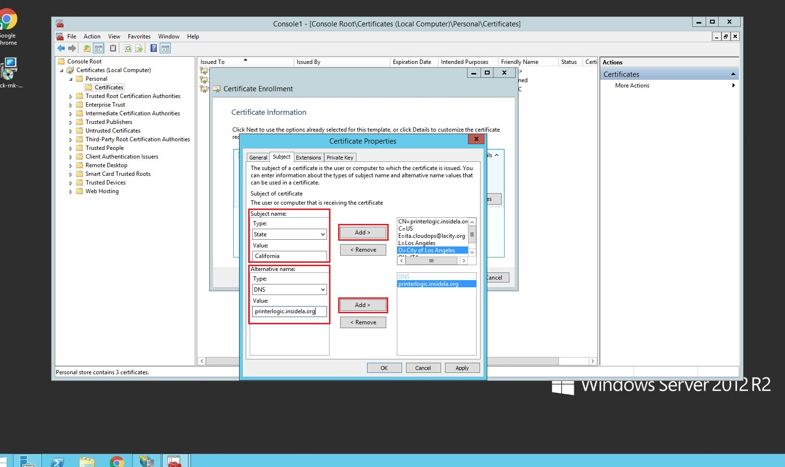

.. IIS CSR Request documentation master file, created by
   sphinx-quickstart on Thu May  7 16:23:56 2020.
   You can adapt this file completely to your liking, but it should at least
   contain the root `toctree` directive.

Welcome to IIS CSR Request's documentation!
===========================================

.. toctree::
   :maxdepth: 2
   :caption: Contents:

.. raw:: html

   
	
	
	
.. role:: red
.. role:: green
.. role:: dblue

Prefix
===============

This documentation is for creating a CSR request on a Windows Server environment
for IIS and submitting it to the DSA group for processing in order to provide you with a SSL certificate. 
DSA requires a Custom CSR because they need the SHA256 setting instead of the default one created when 
creating one via the IIS console.

:green:`Creating a CSR on IIS`
=================================

Step 1
#######
After logging in to the server, on the your keyboard press on the following:

- At the same time press: "Start Button" + "R"
- type **"mmc"**

This will open the following window:

Step 2
#######
Upon a new window opening, click on

1. File
2. Add/Remove Snap-in...

Step 3
########
Click on the following:

1. Certificates
2. Add

3. Select "Computer Account"
4. Click on Next

.. image:: img/step3-snapins-cert2.jpg

5. Select "Local Computer: (the computer this console is running on)
6. Click "Finish"

.. image:: img/step3-snapins-cert3.jpg

7. Click on OK

Step 4
########

1. Drill down:

   - Certificates(Local Computer)
      - Personal
         - Certificates

2. Anywhere in the whitespace **Right Click** on your mouse to bring up the context menu
3. In the context menu drill down to and click on "Create Custom Request"

   - All Tasks
      - Advance Options
         - Create Custom Request

Step 5
#########

1. Click Next

2. Select **Proceed without enrollment policy**
3. Click on **Next**

.. image:: img/step5-policycsr.jpg

4. Select "(No Template) CNG key" for the **Template**
5. Select "PKCS #10" as for the **Request format**
6. Click on **Next**

7. Click on the carrot for **Details**
8. Click on **Properties**

9. In the **General** tab, fill out the 2 boxes with the name of domain this CSR request
is for

10. On the **Subject** tab fill out the details  of the certificate.

   These are the settings for domian **printerlogic.insidela.org** created by **ITA-CloudOps**
   
   **Subject name:**

   1. **Country:** US
   2. **State:** California
   3. **Locality/City:** Los Angeles
   4. **Organization:** City of Los Angeles
   5. **Organizational Unit:** ITA
   6. **Common Name:** paysrsvn.insidela.org
   7. **Email:** ita.cloudops@lacity.org

   **Alternative name**

   1. **DNS:** printerlogic.insidela.org

11. Click on the **Private Key** tab

   Make sure the following settings are applied:

   1. **Key Size:** 2048
   2. **Check Box** Make private key exportable
   3. **Hash Algorithm:** sha256 
   4. Click OK

12. Click **Next**

13. Click on Browse

14. Do the following:

   1. For the location, choose somewhere easily accessible to you, in this case, its in **Downloads**
   2. Enter a filename that is easily identifyable to your CSR request, in this case **printerlogicinsidelacsr**
   3. Click **Save**

15. Verify the following information:

   1. **Filename:** it matches the destination location and filename you chose on **sub step 5-14**
   2. **File format:** Base 64
   3. Finally click on **Finish**

Step 6
##########

1. Navigate to the chosen location on sub step 5-14
2. Verify your csr file is there
3. Finally send it to your team who manages your SSL certificates requests, in this case, ITA-DSA

Step 7 (Optional)
####################

To verify the validility of your certificate request (CSR)

   1. Open your CSR File in notepad

   .. image:: img/step7-opencsr.jpg

   2. Copy the contents of the CSR file

   .. image:: img/step7-copycsr.jpg

   3. Go to https://ssltools.digicert.com/checker/views/csrCheck.jsp

      1. Paste your CSR file contents on the window
      2. Click **Check CSR**

      .. image:: img/step7-pastecsr.jpg

   4. Verify the information is correct on the **Certificate information** tab

      .. image:: img/step7-verifycsr.jpg

